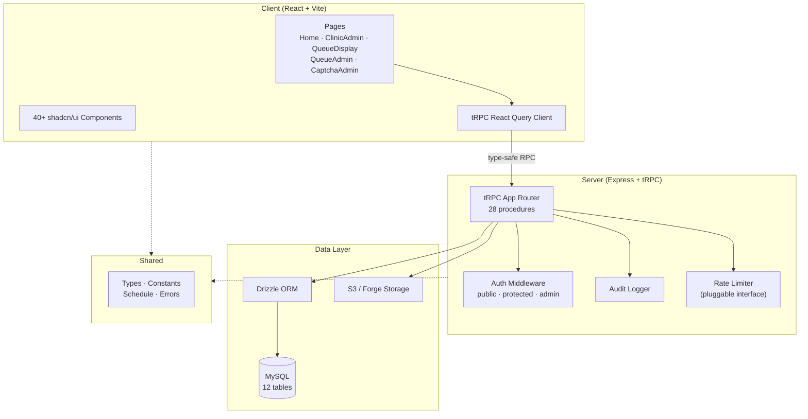
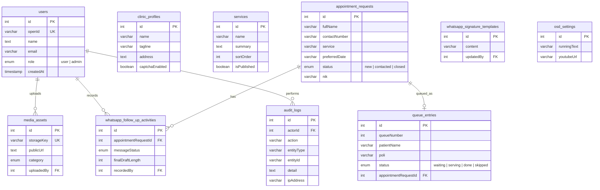

# Klinik Berkat Insani — PrimeCare Clinic Reimagined

[](https://www.typescriptlang.org/)
[](./LICENSE)
[](#testing)

A modern, full-stack TypeScript clinic management system for **Klinik Berkat Insani** — a healthcare clinic in Kotabaru, Kalimantan Selatan, Indonesia. Combines a public landing page with an admin CMS, appointment booking, WhatsApp follow-up tooling, and a patient queue management system.

## Table of Contents

- [Features](#features)
- [Tech Stack](#tech-stack)
- [Architecture](#architecture)
- [Getting Started](#getting-started)
- [Project Structure](#project-structure)
- [API Reference](#api-reference)
- [Database Schema](#database-schema)
- [Security](#security)
- [Testing](#testing)
- [Deployment](#deployment)
- [SWOT Analysis](#swot-analysis)
- [Contributing](#contributing)
- [License](#license)

## Features

- **Public Landing Page** — Editorial clinic website with service showcase, visit preparation guide, Instagram embeds, and WhatsApp contact
- **Online Appointment Booking** — Schedule-aware form with service/date/time selection, multi-layer spam protection (CAPTCHA + honeypot + rate limiting), and consent tracking
- **Admin CMS Dashboard** — Full content management: clinic profile, service CRUD with ordering, media uploads (S3), user management with role-based access
- **WhatsApp Follow-Up System** — Draft messages with character metrics, clipboard copy, direct WhatsApp links, signature templates, and activity tracking
- **Patient Queue Management** — Dedicated queue system with public on-screen display (OSD), YouTube video integration, running text marquee, and admin controls (add/call/complete/skip/reset)
- **Patient Data Management** — Extended patient fields (NIK, birth date/place, address, religion, email, Instagram) with validated input schemas
- **Reporting** — Individual patient reports and aggregate appointment reports
- **Audit Logging** — All admin actions recorded with actor, action, entity, detail, and IP address
- **CAPTCHA Admin** — Toggle Cloudflare Turnstile on/off via admin panel

## Tech Stack

| Category | Technology | Version |
|----------|-----------|---------|
| **Language** | TypeScript | 5.9 |
| **Frontend** | React | 19 |
| **Build Tool** | Vite | 7 |
| **Styling** | Tailwind CSS | 4 |
| **UI Components** | shadcn/ui (Radix UI) | 40+ primitives |
| **Routing** | wouter | 3 |
| **Server State** | TanStack React Query | 5 |
| **API Layer** | tRPC | 11 |
| **Validation** | Zod | 4 |
| **Server** | Express | 4 |
| **ORM** | Drizzle | 0.44 |
| **Database** | MySQL | 8+ |
| **Auth** | jose (JWT/HS256) | — |
| **Testing** | Vitest | 2 |
| **Package Manager** | pnpm | — |

## Architecture



**Monorepo structure**: `client/`, `server/`, `shared/`, `drizzle/` with path aliases (`@/`, `@shared/`) and end-to-end type safety from database schema to React components.

## Getting Started

### Prerequisites

- **Node.js** 20+
- **pnpm** 9+
- **MySQL** 8+ (or MariaDB 10.5+)

### Installation

```bash
git clone https://github.com/nhasibuan/primecare-clinic-reimagined.git
cd primecare-clinic-reimagined
pnpm install
```

### Environment Setup

```bash
cp .env.example .env
# Edit .env with your database credentials and other configuration
```

See [`.env.example`](.env.example) for all available variables and their descriptions.

### Database Setup

```bash
# Generate and apply migrations
pnpm db:push
```

### Development

```bash
pnpm dev
# Server runs at http://localhost:3000
```

## Project Structure

```
├── client/                     # Frontend (React + Vite)
│   └── src/
│       ├── components/         # UI components + business components
│       │   └── ui/            # 40+ shadcn/ui primitives
│       ├── pages/             # Route pages
│       ├── hooks/             # Custom React hooks
│       ├── lib/               # tRPC client, utilities
│       └── contexts/          # Theme provider
├── server/                     # Backend (Express + tRPC)
│   ├── _core/                 # Server infrastructure
│   │   ├── index.ts           # Entry point, Express setup, security headers
│   │   ├── trpc.ts            # tRPC init, procedure definitions
│   │   ├── context.ts         # Request context (auth)
│   │   ├── oauth.ts           # OAuth callback handler
│   │   └── env.ts             # Environment validation
│   ├── routers.ts             # tRPC app router (all API endpoints)
│   ├── db.ts                  # Database queries and business logic
│   ├── auditLog.ts            # Audit logging utility
│   ├── rateLimiter.ts         # Pluggable rate limiter interface
│   ├── appointmentRequest.ts  # Spam protection, rate limiting
│   ├── clinicSchedule.ts      # Schedule validation helpers
│   ├── turnstile.ts           # Cloudflare Turnstile CAPTCHA
│   ├── storage.ts             # S3/Forge presigned uploads
│   └── *.test.ts              # 14 test files
├── shared/                     # Shared between client & server
│   ├── clinicSchedule.ts      # Schedule data (single source of truth)
│   ├── const.ts               # Constants, error messages
│   ├── _core/errors.ts        # Error class hierarchy
│   └── types.ts               # Re-exported schema types
├── drizzle/                    # Database schema & migrations
│   ├── schema.ts              # Full MySQL schema (12 tables)
│   ├── 0000–0008*.sql         # 9 migration files
│   └── meta/                  # Migration metadata
├── .env.example                # Environment template
├── LICENSE                     # MIT License
├── package.json
├── tsconfig.json
├── vite.config.ts
└── vitest.config.ts
```

## API Reference

All endpoints are served via tRPC at `/api/trpc`.

### Auth

| Procedure | Type | Auth | Description |
|-----------|------|------|-------------|
| `auth.me` | query | public | Current authenticated user or null |
| `auth.logout` | mutation | public | Clear session cookie |

### Schedule & CAPTCHA

| Procedure | Type | Auth | Description |
|-----------|------|------|-------------|
| `schedule.getSchedule` | query | public | Clinic operating hours (per poli, per day) |
| `captcha.getEnabled` | query | public | Whether CAPTCHA is active |

### Appointments

| Procedure | Type | Auth | Description |
|-----------|------|------|-------------|
| `appointments.create` | mutation | public | Submit appointment request (CAPTCHA + honeypot + rate limit + schedule validation) |
| `appointments.list` | query | admin | List all appointment requests |
| `appointments.updateStatus` | mutation | admin | Change status (new → contacted → closed) |
| `appointments.listFollowUpActivities` | query | admin | WhatsApp follow-up activity log (filterable) |
| `appointments.recordFollowUpActivity` | mutation | admin | Record WhatsApp follow-up action |
| `appointments.updateSignatureTemplate` | mutation | admin | Save WhatsApp signature template |
| `appointments.updatePatientData` | mutation | admin | Update extended patient data (NIK, DOB, address, etc.) |

### Admin

| Procedure | Type | Auth | Description |
|-----------|------|------|-------------|
| `admin.listUsers` | query | admin | List all users |
| `admin.promoteUser` | mutation | admin | Promote user to admin (self-promotion blocked) |
| `admin.demoteUser` | mutation | admin | Demote admin to user (last-admin guard) |
| `admin.toggleCaptcha` | mutation | admin | Enable/disable CAPTCHA |

### Clinic Content

| Procedure | Type | Auth | Description |
|-----------|------|------|-------------|
| `clinic.publicContent` | query | public | Clinic profile + published services |
| `clinic.adminContent` | query | admin | All services, media assets, signature template |
| `clinic.updateProfile` | mutation | admin | Update clinic profile |
| `clinic.saveService` | mutation | admin | Create/update service |
| `clinic.uploadMedia` | mutation | admin | Upload media asset (base64, max 5MB, rate-limited) |

### Queue

| Procedure | Type | Auth | Description |
|-----------|------|------|-------------|
| `queue.display` | query | public | Public OSD data (redacted patient names) |
| `queue.list` | query | admin | Full queue entries |
| `queue.settings` | query | admin | OSD settings |
| `queue.add` | mutation | admin | Add patient to queue |
| `queue.callNext` | mutation | admin | Call next patient |
| `queue.complete` | mutation | admin | Mark patient as done |
| `queue.skip` | mutation | admin | Skip patient |
| `queue.reset` | mutation | admin | Reset today's queue |
| `queue.updateSettings` | mutation | admin | Update running text + YouTube URL |

## Database Schema



## Security

This application implements **defense-in-depth** with multiple security layers:

| Layer | Implementation |
|-------|---------------|
| **CAPTCHA** | Cloudflare Turnstile on appointment form (admin-toggleable) |
| **Honeypot** | Hidden `website` field silently drops automated submissions |
| **IP Rate Limiting** | 3 requests / 60s per IP (pluggable `RateLimiter` interface) |
| **Upload Rate Limiting** | 20 uploads / 5 min per user |
| **Input Validation** | Zod schemas on all tRPC inputs with regex patterns |
| **RBAC** | Three procedure levels: `public`, `protected`, `admin` |
| **Audit Logging** | All admin mutations recorded with actor, action, entity, IP |
| **CSP** | Strict Content-Security-Policy headers |
| **Security Headers** | `X-Frame-Options: DENY`, `X-Content-Type-Options: nosniff`, HSTS, Referrer-Policy, Permissions-Policy |
| **OAuth + JWT** | HS256 session tokens with 1-year expiry, CSRF protection via `__Host-` prefix cookie |
| **Production Validation** | Fail-fast startup rejects default JWT_SECRET, missing OWNER_OPEN_ID |
| **Data Minimization** | No clinical notes stored; patient names redacted on public OSD |
| **Request Tracing** | Unique `x-request-id` on every request for log correlation |

## Testing

```bash
pnpm test        # Run all tests
pnpm check       # TypeScript type checking
```

**94 tests across 14 test files** covering:
- Role resolution and admin management logic
- Rate limiter behavior (window expiry, eviction)
- Appointment request validation (honeypot, note normalization)
- CAPTCHA verification (Turnstile token + secret resolution)
- WhatsApp follow-up constraints and activity tracking
- Database degradation handling
- Auth logout and cookie clearing
- Schedule validation (client + server)

## Deployment

### Build

```bash
pnpm build
# Client → dist/public/ (Vite, with code splitting)
# Server → dist/index.js (esbuild, ESM)
```

### Start

```bash
NODE_ENV=production node dist/index.js
```

### Production Environment Variables

| Variable | Required | Description |
|----------|----------|-------------|
| `DATABASE_URL` | ✅ | MySQL connection string |
| `JWT_SECRET` | ✅ | ≥ 32 char random secret (not the dev default) |
| `OWNER_OPEN_ID` | ✅ | OAuth OpenID of the clinic owner (bootstraps admin) |
| `OAUTH_SERVER_URL` | ✅ | OAuth provider URL |
| `BUILT_IN_FORGE_API_URL` | ✅ | Forge storage backend URL |
| `BUILT_IN_FORGE_API_KEY` | ✅ | Forge storage API key |
| `TURNSTILE_SECRET_KEY` | ✅ | Cloudflare Turnstile secret |

> ⚠️ **Never** set `TURNSTILE_ALLOW_TEST_KEY` in production — it bypasses CAPTCHA verification.

### Health Check

```
GET /healthz → { status: "ok", db: "connected", timestamp: "..." }
                { status: "degraded", db: "unavailable", ... }  (503)
```

## SWOT Analysis

### Strengths
- **End-to-end type safety** — tRPC + Zod + Drizzle + TypeScript strict mode; types flow from DB schema to React components
- **Defense-in-depth security** — 6-layer protection: CAPTCHA, honeypot, IP rate limiting, upload rate limiting, input validation, CSP/security headers
- **Privacy-by-design** — No clinical notes stored; patient names redacted on public display; WhatsApp activity records only metadata
- **Comprehensive audit trail** — All admin mutations logged with actor, action, entity, IP address
- **94 passing tests** — Critical business logic covered across 14 test files

### Weaknesses
- **In-memory rate limiting** — Resets on restart; not shared across instances (pluggable interface ready for Redis upgrade)
- **Platform coupling** — Storage and OAuth depend on Manus/Forge platform
- **Hardcoded schedule** — Clinic operating hours in source code, not admin-editable
- **No CI/CD pipeline** — Manual deployment; no containerization

### Opportunities
- **WhatsApp Business API** — Automate follow-ups, enable two-way messaging
- **Admin-editable schedule** — Move schedule to DB (deprecated table already exists)
- **Operational analytics** — Dashboard from follow-up metrics + queue data for staff KPIs
- **PWA support** — Offline queue display, push notifications for appointments

### Threats
- **Regulatory compliance** — Stores NIK and personal data; Indonesian UU PDP (2022) requires data protection measures
- **Single admin bootstrap** — Losing OWNER_OPEN_ID account blocks admin access
- **Platform dependency** — Manus/Forge outage disrupts auth and storage simultaneously
- **Medical liability** — System handles real clinic scheduling; downtime has patient safety implications

## Contributing

1. Fork the repository
2. Create a feature branch (`git checkout -b feature/your-feature`)
3. Run tests (`pnpm test`) and type checking (`pnpm check`)
4. Format code (`pnpm format`)
5. Commit with descriptive messages
6. Open a pull request

## License

[MIT](./LICENSE) © 2026 Klinik Berkat Insani Contributors
