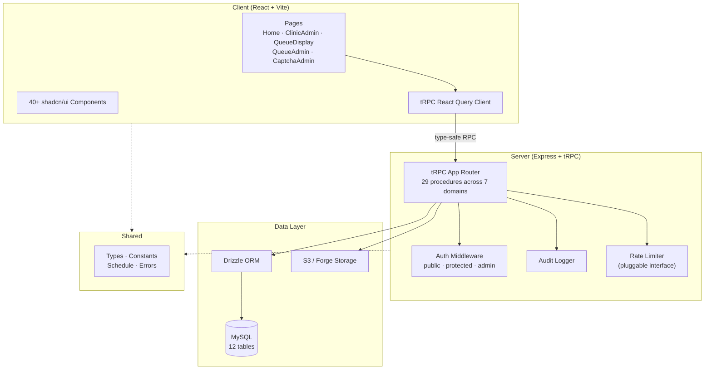
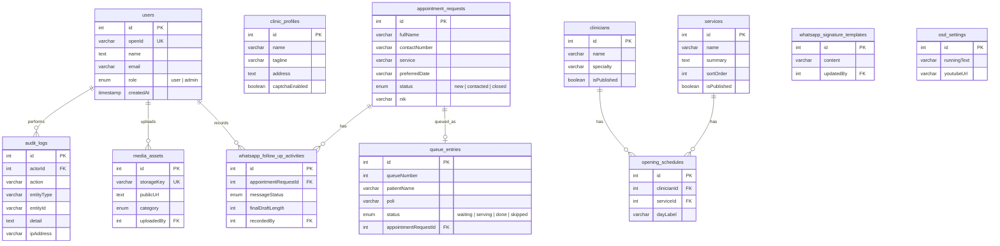

# Klinik Berkat Insani — PrimeCare Clinic Reimagined

[](https://www.typescriptlang.org/)
[](./LICENSE)
[](#testing)

A production-hardened, full-stack TypeScript platform that runs both the public face and the daily operations of **Klinik Berkat Insani**, a healthcare clinic in Kotabaru, Kalimantan Selatan, Indonesia. A single codebase serves the marketing website, online appointment booking with layered anti-spam defenses, a WhatsApp follow-up workflow for staff, a waiting-room patient queue display, patient records management, and a complete admin CMS — all exposed through a type-safe tRPC API, persisted in MySQL 8, shipped as one Node binary, and supervised in production by systemd units covering encrypted backups, restore drills, boot self-checks, and uptime watchdogs.

## Table of Contents

- [Features](#features)
- [Tech Stack](#tech-stack)
- [Architecture](#architecture)
- [Getting Started](#getting-started)
- [Project Structure](#project-structure)
- [API Reference](#api-reference)
- [Database Schema](#database-schema)
- [Security](#security)
- [Testing](#testing)
- [Deployment](#deployment)
- [SWOT Analysis](#swot-analysis)
- [Fact Verification & System Integrity](#fact-verification--system-integrity)
- [Adversarial & Threat Review](#adversarial--threat-review)
- [Contributing](#contributing)
- [License](#license)

## Features

- **Public Landing Page** — Editorial clinic website with service showcase, visit preparation guide, Instagram embeds, and WhatsApp contact
- **Online Appointment Booking** — Schedule-aware form with service/date/time selection, multi-layer spam protection (CAPTCHA + honeypot + rate limiting), and consent tracking
- **Admin CMS Dashboard** — Full content management: clinic profile, service CRUD with ordering, media uploads (S3), user management with role-based access
- **WhatsApp Follow-Up System** — Draft messages with character metrics, clipboard copy, direct WhatsApp links, signature templates, and activity tracking
- **Patient Queue Management** — Dedicated queue system with public on-screen display (OSD), YouTube video integration, running text marquee, and admin controls (add/call/complete/skip/reset)
- **Patient Data Management** — Extended patient fields (NIK, birth date/place, address, religion, email, Instagram) with validated input schemas
- **Reporting** — Individual patient reports and aggregate appointment reports
- **Audit Logging** — All admin actions recorded with actor, action, entity, detail, and IP address
- **CAPTCHA Admin** — Toggle Cloudflare Turnstile on/off via admin panel

## Tech Stack

| Category | Technology | Version |
|----------|-----------|---------|
| **Language** | TypeScript | 7.0 |
| **Runtime** | Node.js | 26 (production) |
| **Frontend** | React | 19 |
| **Build Tool** | Vite | 8 |
| **Styling** | Tailwind CSS | 4 |
| **UI Components** | shadcn/ui (Radix UI) | 40+ primitives |
| **Routing** | wouter | 3 |
| **Server State** | TanStack React Query | 5 |
| **API Layer** | tRPC | 11 |
| **Validation** | Zod | 4 |
| **Server** | Express | 4 |
| **ORM** | Drizzle | 0.45 |
| **Database** | MySQL | 8+ |
| **Distributed Rate Limiting (optional)** | ioredis / Redis | 6 |
| **Auth** | jose (JWT/HS256) | 6 |
| **Testing** | Vitest | 5 |
| **Package Manager** | pnpm | 10 |

## Architecture



**Monorepo structure**: `client/`, `server/`, `shared/`, `drizzle/` with path aliases (`@/`, `@shared/`) and end-to-end type safety from database schema to React components.

## Getting Started

### Prerequisites

- **Node.js** 20+ (production runs Node 26)
- **pnpm** 10+
- **MySQL** 8+ (or MariaDB 10.5+)

### Installation

```bash
git clone https://github.com/nhasibuan/primecare-clinic-reimagined.git
cd primecare-clinic-reimagined
pnpm install
```

### Environment Setup

```bash
cp .env.example .env
# Edit .env with your database credentials and other configuration
```

See [`.env.example`](.env.example) for all available variables and their descriptions.

### Database Setup

```bash
# Generate and apply migrations
pnpm db:push
```

### Development

```bash
pnpm dev
# Server runs at http://localhost:3000
```

## Project Structure

```
├── client/                     # Frontend (React + Vite)
│   └── src/
│       ├── components/         # UI components + business components
│       │   └── ui/            # 40+ shadcn/ui primitives
│       ├── pages/             # Route pages
│       ├── hooks/             # Custom React hooks
│       ├── lib/              # tRPC client, utilities
│       └── contexts/         # Theme provider
├── server/                     # Backend (Express + tRPC)
│   ├── _core/                 # Server infrastructure
│   │   ├── index.ts           # Entry point, Express setup, security headers
│   │   ├── trpc.ts            # tRPC init, procedure definitions
│   │   ├── context.ts         # Request context (auth)
│   │   ├── systemRouter.ts    # Built-in system procedures
│   │   ├── heartbeat.ts       # Liveness heartbeat
│   │   ├── env.ts             # Environment validation
│   │   ├── oauth.ts           # OAuth callback handler
│   │   ├── cookies.ts         # Cookie helpers
│   │   ├── notification.ts    # Notifications
│   │   └── vite.ts            # Vite dev integration
│   ├── routers.ts             # tRPC app router (all API endpoints)
│   ├── db.ts                  # Database queries and business logic
│   ├── auditLog.ts            # Audit logging utility
│   ├── rateLimiter.ts         # Pluggable rate limiter interface
│   ├── redisRateLimiter.ts    # Redis sorted-set sliding-window limiter
│   ├── rateLimiterFactory.ts  # Selects limiter via REDIS_URL
│   ├── encryption.ts          # AES-256-GCM field encryption (HKDF)
│   ├── appointmentRequest.ts  # Spam protection, rate limiting
│   ├── clinicSchedule.ts      # Schedule validation helpers
│   ├── turnstile.ts           # Cloudflare Turnstile CAPTCHA
│   ├── storage.ts             # S3/Forge presigned uploads
│   └── *.test.ts              # 18 test files
├── shared/                     # Shared between client & server
│   ├── clinicSchedule.ts      # Schedule data (single source of truth)
│   ├── const.ts               # Constants, error messages
│   ├── _core/errors.ts        # Error class hierarchy
│   └── types.ts               # Re-exported schema types
├── drizzle/                    # Database schema & migrations
│   ├── schema.ts              # Full MySQL schema (12 tables)
│   ├── 0000–0009*.sql         # Migration files
│   └── meta/                  # Migration metadata
├── deploy/                     # Production systemd units
│   ├── primecare.service              # Main app service
│   ├── primecare-backup.service/.timer   # Daily encrypted MySQL backups
│   ├── primecare-restore-drill.service/.timer  # Monthly restore drill
│   ├── primecare-watchdog.service/.timer       # Uptime watchdog
│   └── primecare-bootcheck.service            # Post-boot self-check
├── scripts/                    # Ops & maintenance scripts
│   ├── backfillPiiEncryption.ts
│   ├── restoreDrillCheck.mts
│   ├── setAdminPassword.mjs
│   └── hashPassword.mjs
├── .env.example                # Environment template
├── LICENSE                     # MIT License
├── package.json
├── tsconfig.json
├── vite.config.ts
└── vitest.config.ts
```

## API Reference

All endpoints are served via tRPC at `/api/trpc`.

### Auth

| Procedure | Type | Auth | Description |
|-----------|------|------|-------------|
| `auth.me` | query | public | Current authenticated user or null |
| `auth.logout` | mutation | public | Clear session cookie |

### Schedule & CAPTCHA

| Procedure | Type | Auth | Description |
|-----------|------|------|-------------|
| `schedule.getSchedule` | query | public | Clinic operating hours (per poli, per day) |
| `captcha.getEnabled` | query | public | Whether CAPTCHA is active |

### Appointments

| Procedure | Type | Auth | Description |
|-----------|------|------|-------------|
| `appointments.create` | mutation | public | Submit appointment request (CAPTCHA + honeypot + rate limit + schedule validation) |
| `appointments.list` | query | admin | List all appointment requests |
| `appointments.updateStatus` | mutation | admin | Change status (new → contacted → closed) |
| `appointments.listFollowUpActivities` | query | admin | WhatsApp follow-up activity log (filterable) |
| `appointments.recordFollowUpActivity` | mutation | admin | Record WhatsApp follow-up action |
| `appointments.updateSignatureTemplate` | mutation | admin | Save WhatsApp signature template |
| `appointments.updatePatientData` | mutation | admin | Update extended patient data (NIK, DOB, address, etc.) |

### Admin

| Procedure | Type | Auth | Description |
|-----------|------|------|-------------|
| `admin.listUsers` | query | admin | List all users |
| `admin.promoteUser` | mutation | admin | Promote user to admin (self-promotion blocked) |
| `admin.demoteUser` | mutation | admin | Demote admin to user (last-admin guard) |
| `admin.toggleCaptcha` | mutation | admin | Enable/disable CAPTCHA |

### Clinic Content

| Procedure | Type | Auth | Description |
|-----------|------|------|-------------|
| `clinic.publicContent` | query | public | Clinic profile + published services |
| `clinic.adminContent` | query | admin | All services, media assets, signature template |
| `clinic.updateProfile` | mutation | admin | Update clinic profile |
| `clinic.saveService` | mutation | admin | Create/update service |
| `clinic.uploadMedia` | mutation | admin | Upload media asset (base64, max 5MB, rate-limited) |

### Queue

| Procedure | Type | Auth | Description |
|-----------|------|------|-------------|
| `queue.display` | query | public | Public OSD data (redacted patient names) |
| `queue.list` | query | admin | Full queue entries |
| `queue.settings` | query | admin | OSD settings |
| `queue.add` | mutation | admin | Add patient to queue |
| `queue.callNext` | mutation | admin | Call next patient |
| `queue.complete` | mutation | admin | Mark patient as done |
| `queue.skip` | mutation | admin | Skip patient |
| `queue.reset` | mutation | admin | Reset today's queue |
| `queue.updateSettings` | mutation | admin | Update running text + YouTube URL |

## Database Schema

12 MySQL tables (`clinicians` and `opening_schedules` are deprecated — retained for migration compatibility):



## Security

This application implements **defense-in-depth** with multiple security layers:

| Layer | Implementation |
|-------|---------------|
| **CAPTCHA** | Cloudflare Turnstile on appointment form (admin-toggleable) |
| **Honeypot** | Hidden `website` field silently drops automated submissions |
| **IP Rate Limiting** | True sliding window, 3 requests / 60s per IP (pluggable `RateLimiter` interface) — enforced before the outbound CAPTCHA call; upgrades to a shared Redis-backed limiter when `REDIS_URL` is set (fail-open with throttled warnings) |
| **Upload Rate Limiting** | 20 uploads / 5 min per user (same pluggable interface) |
| **Input Validation** | Zod schemas on all tRPC inputs with regex patterns |
| **RBAC** | Three procedure levels: `public`, `protected`, `admin` |
| **Audit Logging** | All admin mutations recorded with actor, action, entity, IP (queue resets include deleted-row count) |
| **CSP** | Strict Content-Security-Policy headers |
| **Security Headers** | `X-Frame-Options: DENY`, `X-Content-Type-Options: nosniff`, HSTS, Referrer-Policy, Permissions-Policy |
| **OAuth + JWT** | HS256 session tokens with 1-year expiry; session cookie is `__Host-` prefixed in production (plus SameSite=Lax and HttpOnly) |
| **PII Encryption at Rest** | AES-256-GCM (HKDF-derived key) for full name, phone, notes, NIK, birth place/date, address, email, and queue patient names — columns widened for envelopes, fail-fast required in production (`ALLOW_PLAINTEXT_PII=true` overrides with a loud warning) |
| **Production Validation** | Fail-fast startup rejects default JWT_SECRET, missing OWNER_OPEN_ID, missing PII_ENCRYPTION_KEY |
| **Data Minimization** | No clinical notes stored; patient names redacted on public OSD |
| **Request Tracing** | Unique `x-request-id` on every request for log correlation |

## Testing

```bash
pnpm test        # Run all tests (vitest run)
pnpm check       # TypeScript type checking
```

**134 tests passing (1 skipped) across 18 test files**, covering:
- Role resolution and admin management logic
- Rate limiter behavior (window expiry, eviction; in-memory and Redis sorted-set)
- Appointment request validation (honeypot, note normalization, rate limits)
- CAPTCHA verification (Turnstile token + secret resolution)
- WhatsApp follow-up constraints, message metrics, and activity tracking
- Database degradation handling
- Auth logout and cookie clearing
- Local auth routes (login, password hashing)
- PII encryption envelopes (AES-256-GCM, capacity contracts)
- Schedule validation (client + server)

## Deployment

> 📋 **Deploying to production?** Read [`DEPLOYMENT_ROLLOUT.md`](./DEPLOYMENT_ROLLOUT.md) first — the new server refuses to start without `PII_ENCRYPTION_KEY`, and migration `0009` must run before encrypted writes.

### Build

```bash
pnpm build
# Client → dist/public/ (Vite, with code splitting)
# Server → dist/index.js (esbuild, ESM)
```

### Start

```bash
NODE_ENV=production node dist/index.js
```

### Production Operations (systemd)

The `deploy/` directory ships production systemd units — the app is supervised, backed up, and self-checked without manual intervention:

| Unit | Schedule | Purpose |
|------|----------|---------|
| `primecare.service` | always | Main application service |
| `primecare-backup.service` + `.timer` | daily | Encrypted MySQL backups |
| `primecare-restore-drill.service` + `.timer` | monthly | Automated restore drill (verifies backups are actually restorable) |
| `primecare-watchdog.service` + `.timer` | periodic | Uptime watchdog |
| `primecare-bootcheck.service` | on boot | Post-boot self-check of the production stack |

A CI **production-audit gate** additionally blocks releases that fail the audit checklist, and Dependabot merges are batched and verified before landing.

### Production Environment Variables

| Variable | Required | Description |
|----------|----------|-------------|
| `DATABASE_URL` | ✅ | MySQL connection string |
| `JWT_SECRET` | ✅ | ≥ 32 char random secret (not the dev default) |
| `OWNER_OPEN_ID` | ✅ | OAuth OpenID of the clinic owner (bootstraps admin) |
| `OAUTH_SERVER_URL` | ✅ | OAuth provider URL |
| `BUILT_IN_FORGE_API_URL` | ✅ | Forge storage backend URL |
| `BUILT_IN_FORGE_API_KEY` | ✅ | Forge storage API key |
| `TURNSTILE_SECRET_KEY` | ✅ | Cloudflare Turnstile secret |
| `PII_ENCRYPTION_KEY` | ✅ | ≥ 32 chars; AES-256-GCM key for patient PII encryption at rest. Launch without it only by setting `ALLOW_PLAINTEXT_PII=true` (warns loudly) |
| `REDIS_URL` | — | Optional; enables the shared Redis-backed rate limiter for multi-instance deployments |

> ⚠️ **Never** set `TURNSTILE_ALLOW_TEST_KEY` in production — it bypasses CAPTCHA verification.
>
> ⚠️ **Never** set `ALLOW_PLAINTEXT_PII=true` in production except as a short-lived migration measure — it stores patient NIK and contact data unencrypted.

### Health Check

```
GET /healthz → { status: "ok", db: "connected", timestamp: "..." }
                { status: "degraded", db: "unavailable", ... }  (503)
```

## SWOT Analysis

### Strengths
- **End-to-End Type Safety & Contract Integrity**: Strict TypeScript 7 + tRPC 11 + Zod 4 + Drizzle 0.45 ensures compile-time and runtime validation spanning database entities to React UI components.
- **Multi-Tiered Defense-in-Depth**: Six defensive layers protect public endpoints, ordered cheapest-first: honeypot, sliding-window IP rate limiting (bounding even the outbound CAPTCHA call), pure-function schedule validation, Cloudflare Turnstile CAPTCHA, authenticated upload throttling, and hardened HTTP security headers (CSP, HSTS, X-Frame-Options).
- **Privacy-by-Design Architecture**: Strict data minimization avoids persisting clinical diagnosis notes in the web layer; patient names are dynamically redacted on public waiting-room displays, and WhatsApp follow-up logs preserve only telemetry/metadata. Sensitive PII columns are AES-256-GCM encrypted at rest with fail-fast production enforcement.
- **Comprehensive Immutable Audit Trail**: Admin actions (user role alterations, queue resets, clinic profile updates, media uploads) are recorded with actor ID, entity reference, mutation detail, and remote IP address.
- **Self-Healing Production Operations**: Daily encrypted MySQL backups, monthly automated restore drills, an uptime watchdog, post-boot self-checks, and a CI production-audit gate — backup restorability is *proven*, not assumed.
- **Robust Automated Verification**: 141 tests passing across 18 suites provide high confidence in scheduling logic, role guards, failover behavior, encryption envelopes, ciphertext capacity, and PII key-ring rotation.

### Weaknesses
- **Operational Dependency for Distributed Rate Limiting**: The Redis-backed limiter shares quota across instances but depends on a reachable Redis; a Redis outage degrades to per-instance fail-open limits with throttled warnings until connectivity returns.
- **Platform & Vendor Coupling**: Auth callbacks and file storage are tightly coupled to Forge/Manus platform APIs; self-hosted S3/MinIO or generic OIDC requires adapter refactoring.
- **Static Clinic Schedule**: Operating hours and poli availability are defined in code (`shared/clinicSchedule.ts`), requiring code redeployment rather than dynamic CMS modification. (The `clinicians` / `opening_schedules` tables exist but are deprecated and unused.)
- **Plaintext PII Residuals Outside Encrypted Columns**: The remaining plaintext columns are low-sensitivity (`agama`, `instagramUrl`, doctor/poli labels) — but backup security still reduces to PII encryption-key custody. Key rotation is now supported (2026-10-03): `PII_ENCRYPTION_KEYS` ring (first key encrypts, retired keys kept for decryption), `scripts/rotatePiiKey.ts` re-encryption tooling, and the rotation/break-glass runbook in `SECRETS_RECOVERY.md`.

### Opportunities
- **Official WhatsApp Business Platform (Cloud API)**: Transition from desktop URI links (`wa.me`) to verified template messaging with automated webhooks and bi-directional status tracking.
- **Rate-Limiter Observability**: The Redis-backed `RateLimiter` is implemented (sorted-set sliding window, fail-open with throttled warnings); next steps are hit-rate metrics and alerting on degradation events.
- **Indonesian UU PDP Compliance Hardening**: Extend encryption coverage to backups and add explicit consent logs and patient data deletion workflows on top of the existing field-level AES-256-GCM.
- **PWA & Offline Queue Display**: Enable Progressive Web App caching and service workers for the clinic waiting-room TV display to survive intermittent internet drops.
- **Key Management Maturity**: Implemented 2026-10-03 — PII key rotation via the `PII_ENCRYPTION_KEYS` ring (decryption tries each key in order; `v1:` envelope retained), `scripts/rotatePiiKey.ts` idempotent re-encryption, and the rotation/break-glass runbook in `SECRETS_RECOVERY.md`. Next: versioned envelopes beyond `v1:` and multi-admin recovery.

### Threats
- **Regulatory Penalties (Indonesian Personal Data Protection Law / UU PDP No. 27/2022)**: Storage of sensitive identity data (NIK, birth details) carries strict liability; any unauthorized database exposure poses severe compliance and legal risks.
- **Single Owner Bootstrap Vulnerability**: Administrative root privileges rely on a single environment variable (`OWNER_OPEN_ID`); loss or compromise of this identity provider credential locks or jeopardizes admin control.
- **Third-Party Infrastructure Outages**: Concurrent dependency on Cloudflare Turnstile, YouTube OSD embeds, and external OAuth means third-party downtime degrades critical user journeys.
- **Healthcare Operational Impact**: Incorrect queue states or missed follow-ups directly affect real-world clinical operations and patient care continuity.
- **Documentation Drift**: The README previously carried stale dependency versions and test counts for multiple release cycles — a leading indicator that operational runbooks can silently diverge from the system they describe unless verification is automated.

### Strategic Initiatives Matrix

| Strategy | Focus | Action Item |
|----------|-------|-------------|
| **SO (Strengths + Opportunities)** | Type Safety & WhatsApp API | Leverage end-to-end Zod schemas to build fully automated, typed WhatsApp Cloud API outbound queues. |
| **ST (Strengths + Threats)** | Audit Trail & PDP Compliance | Extend audit logging to patient PII read events, demonstrating regulatory accountability under UU PDP. |
| **WO (Weaknesses + Opportunities)** | Redis Rate Limiting | Implemented; extend with hit-rate metrics and degradation alerting. |
| **WT (Weaknesses + Threats)** | Encryption & Key Recovery | `fullName`/`note`/queue names now encrypted; configure key rotation, backup encryption verification, and multi-admin recovery protocols. |

---

## Fact Verification & System Integrity

A codebase verification pass was executed against the live repository on **2026-10-02**, re-verified **2026-10-03** after the security remediation (session TTL, PII key rotation, README drift guard):

| Claim / Specification | Target in Codebase | Verification Method | Status | Notes |
|-----------------------|--------------------|---------------------|:------:|-------|
| **Unit & Integration Tests** | 141 passing, 1 skipped (18 files) | `vitest run` | ✅ **Verified** | 141 passed, 1 skipped (`turnstile.secret.test.ts` requiring live secret key) across 18 test files, in ~10s. |
| **Type Checking** | Strict TypeScript 7 | `tsc --noEmit` | ✅ **Verified** | 0 errors across frontend and backend modules. |
| **Production Build** | Client + Server bundles | `pnpm build` | ✅ **Verified** | Vite client bundle (`dist/public/`) and esbuild ESM server (`dist/index.js`) generate cleanly. |
| **Database Schema** | 12 MySQL tables | `drizzle/schema.ts` | ✅ **Verified** | Exactly 12 tables: `users`, `clinic_profiles`, `clinicians` (deprecated), `services`, `media_assets`, `appointment_requests`, `whatsapp_follow_up_activities`, `whatsapp_signature_templates`, `queue_entries`, `opening_schedules` (deprecated), `osd_settings`, `audit_logs`. |
| **tRPC API Procedures** | 29 API procedures | `server/routers.ts` | ✅ **Verified** | 29 procedures across 7 domain sub-routers (`schedule`, `captcha`, `auth`, `appointments`, `clinic`, `queue`, `admin`) plus the built-in system router. |
| **Rate Limiter Design** | Pluggable interface | `server/rateLimiter.ts`, `server/redisRateLimiter.ts`, `server/rateLimiterFactory.ts` | ✅ **Verified** | In-memory **true sliding window** (per-key event logs, bounded memory, LRU-style eviction) plus a Redis sorted-set adapter sharing identical semantics; `REDIS_URL` selects the distributed one via the factory. |
| **Security Headers** | CSP, HSTS, X-Frame-Options | `server/_core/index.ts` | ✅ **Verified** | Hardened custom middleware enforcing zero iframe embedding, strict CSP, and nosniff. |
| **PII Encryption** | AES-256-GCM field encryption | `server/encryption.ts` + repositories | ✅ **Verified** | HKDF-SHA256 key derivation, `v1:` versioned envelope, pass-through when unconfigured, fail-fast enforced in production; columns widened (migration 0009) and envelope-capacity contract-tested. Key-ring rotation supported (`PII_ENCRYPTION_KEYS`, first key primary). |
| **Production Operations** | systemd units | `deploy/` | ✅ **Verified** | `primecare.service`, daily encrypted backup timer, monthly restore-drill timer, uptime watchdog timer, and post-boot self-check service all present. |
| **Dependency Versions** | `package.json` | manifest inspection | ✅ **Verified** | TypeScript 7.0.2, Vite 8.3.1, Vitest 5.0.2, Drizzle 0.45.3, tRPC 11, React 19, Node 26 runtime. |

---

## Adversarial & Threat Review

A comprehensive adversarial security evaluation identified the following threat vectors, exploit pathways, and mitigation controls:

### 1. Automated Flooding & Resource Exhaustion (DoS / Spam)
- **Threat Vector**: Malicious bots flooding `appointments.create` to saturate database storage, lock clinic queue numbers, and exhaust staff follow-up capacity.
- **Attack Surface**: Publicly accessible tRPC mutation `appointments.create`.
- **Adversarial Bypasses**:
  - Rotating IP pools (residential proxies) bypass the single-IP rate limit (3 requests / 60 seconds).
  - Programmatic headless browsers executing JavaScript can solve or bypass CAPTCHA if `captchaEnabled` is toggled off by an administrator.
- **Mitigation & Hardening**:
  - Multi-layered filter: Hidden honeypot trap (`website` input field) silently drops non-human submissions without error reflection.
  - Strict Zod validation on Indonesian phone format (`08...` or `+62...`), date format (`YYYY-MM-DD`), and clinic schedule slot limits.
  - Recommended enhancement: Implement proof-of-work (PoW) or phone number OTP verification prior to queue ticket confirmation.

### 2. Administrative Privilege Escalation & Account Takeover
- **Threat Vector**: Compromise of an admin session or unauthorized role elevation leading to data exfiltration or clinic defacement.
- **Attack Surface**: `admin.promoteUser`, `admin.demoteUser`, and session cookies.
- **Defensive Safeguards Evaluated**:
  - **Self-Promotion Guard**: `admin.promoteUser` rejects requests where target ID matches current user ID.
  - **Last-Admin Lock**: `admin.demoteUser` checks the total active admin count before allowing demotion, preventing accidental lockout.
  - **Cookie Security**: Auth cookies utilize `HttpOnly`, `SameSite=Lax`, and `__Host-` prefix in production.
- **Remaining Risk**: Single root owner bootstrap via `OWNER_OPEN_ID`. If the OAuth provider issues a hijacked OpenID token matching this value, full administrative takeover occurs. Additionally, HS256 session tokens previously carried a **1-year expiry** — mitigated 2026-10-03: session JWTs and cookies now use `SESSION_TTL_MS` (**30 days**) across `sdk.ts`, `localAuth.ts`, `oauth.ts`, and `devAuth.ts`. Session-key rotation remains future work.

### 3. Patient Data Privacy & Compliance (Indonesian UU PDP No. 27/2022)
- **Threat Vector**: Unauthorized exfiltration of patient identification records (NIK, birth dates, full addresses, WhatsApp numbers) via SQL injection or unauthorized admin database dumps.
- **Attack Surface**: `appointment_requests` and `queue_entries` tables.
- **Defensive Safeguards Evaluated**:
  - Drizzle ORM uses parameterized SQL queries throughout, effectively mitigating classic SQL injection.
  - Public On-Screen Display (`queue.display`) strictly masks patient names (e.g., "A*** B***") and excludes phone numbers and NIK.
- **Remaining Risk**: Patient PII (names, contacts, NIK, demographics, notes, queue names) is encrypted at rest (AES-256-GCM); the residual attack surface is key custody — database dumps contain ciphertext only as strong as PII encryption-key protection, plus the low-sensitivity `agama`/`instagramUrl` plaintext columns. Rotation support added 2026-10-03: `PII_ENCRYPTION_KEYS` comma-separated ring (first entry encrypts, decryption tries each key), `scripts/rotatePiiKey.ts` re-encrypts all PII columns idempotently, procedure documented in `SECRETS_RECOVERY.md`. **Encrypted backups are only as safe as the key**: anyone holding both a backup and the key reads everything — key storage must be isolated from backup storage.

### 4. Public Waiting Room Display (OSD) Tampering & XSS
- **Threat Vector**: Malicious actor altering `osd_settings.youtubeUrl` or `osd_settings.runningText` to display phishing links, offensive media, or execute Stored XSS on the clinic TV.
- **Attack Surface**: `queue.updateSettings` mutation and `QueueDisplay.tsx` rendering.
- **Defensive Safeguards Evaluated**:
  - `queue.updateSettings` is strictly protected by `adminProcedure` middleware.
  - YouTube URL is sanitized using regex parsing for valid 11-character video IDs.
  - React JSX auto-escapes string content in the marquee running text, preventing DOM-based script injection.

### 5. Dependency Supply Chain Audit
- **Findings**: Package audit previously identified vulnerabilities concentrated in transitive documentation/diagramming dependencies (`streamdown` > `mermaid` > `dompurify`).
- **Production Impact Assessment**: None of these packages are exposed to unauthenticated user input on the server API layer.
- **Remediation**: `pnpm.overrides` in `package.json` now pins patched floors (`dompurify >= 3.4.8`, `mermaid >= 11.16.1`, `tar >= 7.5.21`, `lodash >= 4.17.23`, among others), enforced by the CI production-audit gate — run `pnpm audit --prod` on each maintenance cycle to confirm.

### 6. Documentation & Operational Drift (New)
- **Threat Vector**: Stale runbooks and README claims (dependency versions, test counts, table inventories) silently diverge from the deployed system, causing operators to trust wrong rollback/verification steps during incidents.
- **Evidence**: Prior to this refresh, the README listed TypeScript 5.9 / Vite 7 / Vitest 2 (actual: 7.0.2 / 8.3.1 / 5.0.2), claimed 14–15 test files (actual: 18), named two tables that do not exist (`clinic_schedules`, `presigned_urls`) while omitting two that do (`clinicians`, `opening_schedules`), and documented none of the backup/restore/watchdog systemd units.
- **Mitigation**: Implemented 2026-10-03 — `scripts/verifyReadme.mjs` (run via `pnpm docs:verify`, wired into the CI `verify` job in `.github/workflows/dependencies.yml`) fails when README claims drift: dependency versions vs `package.json`, drizzle table count vs `drizzle/schema.ts`, and test-file count vs the vitest include set. The fact-verification table above is dated and reproducible.

## Contributing

1. Fork the repository
2. Create a feature branch (`git checkout -b feature/your-feature`)
3. Run tests (`pnpm test`) and type checking (`pnpm check`)
4. Format code (`pnpm format`)
5. Commit with descriptive messages
6. Open a pull request

## License

[MIT](./LICENSE) © 2026 Klinik Berkat Insani Contributors
